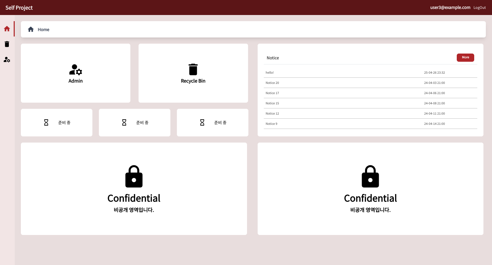
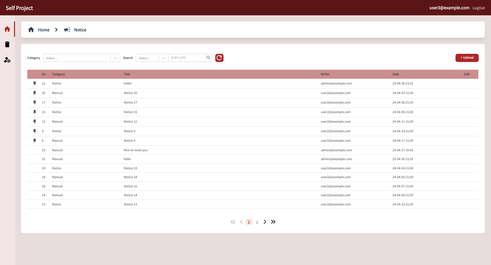
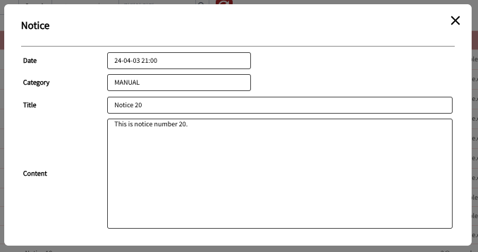
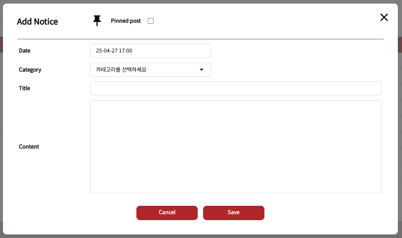
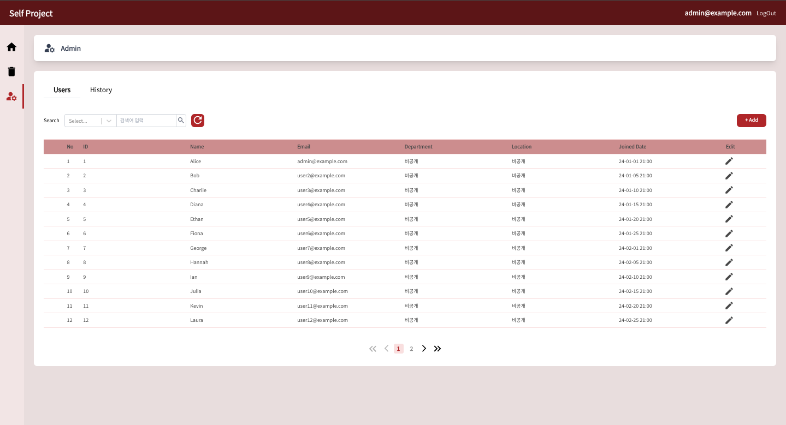
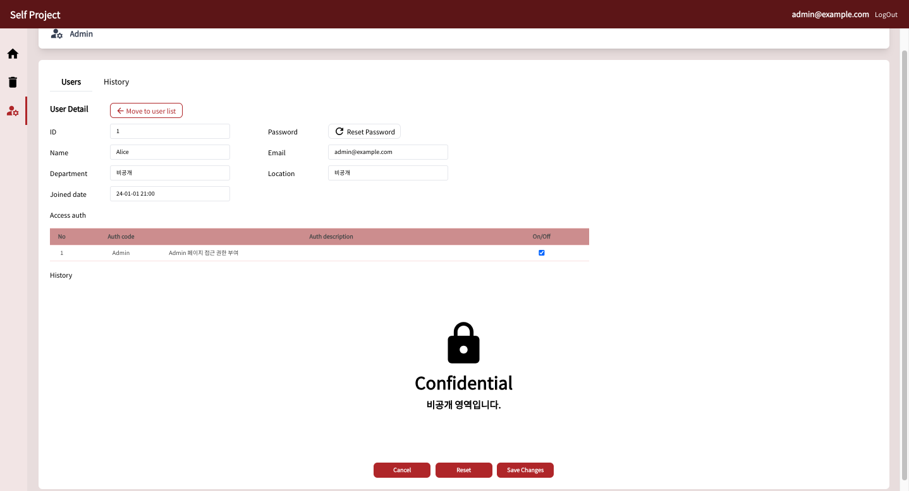

# 프로젝트명: Self Project

## 개요

- 본 프로젝트는 실무에서 실제 구현한 항목들을 재구성한 프로젝트입니다.
- Next.js 기반으로 Layout, UserInfo, Notice, Admin 페이지와 일부 빈 화면을 제작했습니다.
- 사용된 데이터 및 UI 디자인은 실제 구현체와 다릅니다.
- 모든 코드 및 리소스는 비상업적 목적으로만 활용됩니다.

---

## 주요 기능

- 공통 영역

  1. 레이아웃
  2. 필터창
  3. 페이지네이션

- Notice 페이지

  1. 공지사항 목록 조회
  2. 공지사항 상세 보기, 수정 (본인 작성에 한함), 삭제 (본인 작성에 한함), 신규 작성

- Admin 페이지

  1. User 목록 확인 - Role이 admin인 사용자에 한함
  2. User 권한 부여 페이지 - Roledl admin인 사용자에 한함

- Login 페이지

  1. 로그인 되지 않은 사용자는 홈페이지 진입 불가능

- Recycle 빈 페이지
  1. 기능 추가 전인 빈 페이지

---

## 화면 예시

### 메인 페이지



## Notice 페이지





## Admin 페이지




---

## 사용 기술

- Next.js 15
- TypeScript
- TailwindCSS
- Zustand
- Axios
- JSON-Server (가상 API 서버) - 실무에서는 MySQL을 사용했으나 포트폴리오용으로 대체하였습니다.

---

## 배포 링크 (Deployments)
Netlify와 Railway 각각의 한계로 서로 연결되지 않은 배포 링크입니다. 전체적인 UI 확인만 가능합니다.

- 프론트엔드 (Netlify): [바로가기](https://golden-malabi-b38f13.netlify.app/)
- 백엔드 API (Railway): [바로가기](https://self-project-production.up.railway.app/)

---

## 프로젝트 실행 방법 (VSCode에서 실행합니다.)
1. 프로젝트 클론
   ```
   git clone https://github.com/soyello/self-project.git
   cd self-project
   ```
2. 의존성 설치
   ```
   pnpm install
   ```
3. 환경변수 설정
   프로젝트 루트에 `.env.local` 파일을 생성하고 다음 내용을 입력합니다.
   ```
   NEXT_PUBLIC_API_URL=https://self-project-production.up.railway.app
   ```
   주의: `.env.local`파일은 직접 만들어야하며, github에 포함되어있지 않습니다.
4. JSON-Server 실행
   ```
   pnpm start
   ```
   `db.json`을 기반으로 로컬 서버가 구동됩니다.
5. Next.js 개발 서버 실행
   ```
   pnpm run dev
   ```

---

## 테스트 계정 안내

테스트용 로그인 계정을 제공합니다.

| 구분                | 아이디 (Email)    | 비밀번호 (Password) | 권한 (Role) |
| :------------------ | :---------------- | :------------------ | :---------- |
| 관리자 계정 (Admin) | admin@example.com | 12345               | Admin       |
| 사용자 계정 (User)  | user5@example.com | 12345               | User        |

> ※ 해당 계정들은 테스트용으로만 제공되며, 별도의 개인정보는 저장되지 않습니다.

---
   
